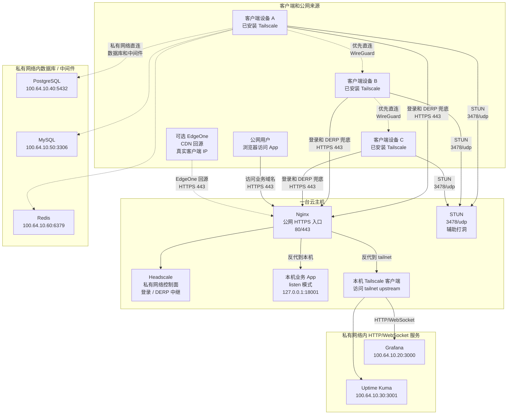

# Lanpanel

[English](README.md) | 简体中文

Lanpanel 是一个面向单台 Debian/Ubuntu 服务器的私有网络和应用发布工具，不是 VPN 客户端。它可以部署 Headscale、Nginx、HTTPS 证书续期和 systemd 服务，也可以只把同机 Go Web 服务或 tailnet 内 HTTP/WebSocket 服务发布到公网 HTTPS。

当前推荐入口是 Management UI：在服务器上启动 UI，通过 SSH 端口转发在自己电脑浏览器里打开面板，然后完成配置、部署、App 发布、Browser Auth、GoAccess、EdgeOne RealIP、客户端接入密钥生成和任务查看。CLI 仍然保留完整能力，适合自动化、无浏览器环境和排障。

## 适用范围

适合：

- 自建私有 Tailscale/Headscale 网络，并由 Lanpanel 管理 Headscale、Nginx、证书和 systemd。
- 把同机 Go Web 服务发布到 HTTPS。
- 把 tailnet 内固定 HTTP/WebSocket upstream 发布到 HTTPS。
- 给 App 增加 Browser Basic Auth、GoAccess 实时访问日志看板，或腾讯云 EdgeOne 真实客户端 IP 还原。
- 通过本机 UI 或 CLI 做小团队、单机、可审计的运维。

不适合：

- 多机高可用、Kubernetes、Terraform、Ansible。
- 公网远程控制面、OIDC/SSO、RBAC、多账号商业面板。
- 通用反向代理框架、Tailscale 客户端替代品、数据库端口发布器。
- 自动管理云防火墙、自动确认 EdgeOne 回源 IP 更新、完整备份/恢复系统。

当前基线：

| 范围 | 基线 |
| --- | --- |
| 服务器系统 | Debian、Ubuntu，或具备 apt/dpkg/systemd 的 Debian 系发行版 |
| Headscale | v0.29.1，只监听 loopback 本机地址，由 Nginx 对外代理 |
| TLS 自动化 | HTTP-01 或 DNS-01，使用 Lanpanel 管理的固定 lego v5.2.2 |
| 中继 | Headscale 内置 DERP/STUN，`3478/udp` 用于 STUN，不接入官方 DERP 列表 |
| 客户端 | Windows、macOS、Debian/Ubuntu Linux |
| 客户端基线 | Tailscale-compatible client >= v1.80.0 |

## 文档入口

第一次使用建议先读本 README 和 [UI 面板手册](docs/zh-CN/ui.md)。只发布业务服务时再读 [发布业务服务 App](docs/zh-CN/app.md)；需要命令行自动化时再读 [CLI 运维手册](docs/zh-CN/cli.md)。

- [UI 面板手册](docs/zh-CN/ui.md)：如何启动 Management UI、打开浏览器、理解页面、提交任务和查看一次性密钥。
- [发布业务服务 App](docs/zh-CN/app.md)：用 UI 或 CLI 发布 `listen` / `upstream` App，配置 Browser Auth、GoAccess 和 EdgeOne RealIP。
- [CLI 运维手册](docs/zh-CN/cli.md)：`init`、`deploy`、`verify`、`status`、`app`、`realip` 命令和 JSON 输出。
- [服务器和客户端运维](docs/zh-CN/operations.md)：服务器准备、DNS/ACME、主网络部署、客户端接入、安全边界和排障。
- [开发和人工测试](docs/zh-CN/development.md)：源码构建、测试、Playwright E2E、手动启动模拟 UI 后用浏览器检查。

## 一图看懂架构

这张图只展示客户端设备、公网用户和云主机之间的连接关系。



普通用户只需要记住：多台客户端设备先通过云主机上的 Headscale 登录私有网络；设备之间优先 WireGuard 直连，直连失败才通过云主机的 DERP 兜底；公网用户访问业务域名时只进入云主机 Nginx；本机 App 只监听本机地址；发布私有网络内 HTTP/WebSocket 服务时，云主机通过本机 Tailscale 客户端访问固定 `100.64.x.y:port`。

`upstream` 只适合发布 HTTP/WebSocket 服务，例如 Grafana、Uptime Kuma、内部管理后台。PostgreSQL、MySQL、Redis 这类数据库或中间件端口不是 HTTP/WebSocket，不应通过这里的 Nginx App 反代发布；需要访问时，通常让客户端加入私有网络后直接连接内网地址，例如 `PostgreSQL: 100.64.10.40:5432`、`MySQL: 100.64.10.50:3306`、`Redis: 100.64.10.60:6379`。

## 快速开始

准备一台 Debian/Ubuntu 或 Debian 系服务器、一个解析到服务器的公网域名，以及 root 或 sudo 权限。主 Headscale 部署需要放行：

- `80/tcp`
- `443/tcp`
- `3478/udp`

只发布同机 App 时通常只需要 `80/tcp` 和 `443/tcp`。

新手先不要急着改高级选项。先完成一个最小闭环：启动 UI、创建配置、Verify、Deploy，再按 Jobs 里的提示处理失败项。

安装 Release 二进制时，先在 GitHub Releases 复制真实稳定 tag，再替换下面的 `vX.Y.Z`：

```bash
VERSION=vX.Y.Z
curl -fsSL "https://raw.githubusercontent.com/simp-lee/lanpanel/${VERSION}/scripts/install.sh" | sh -s -- "${VERSION}"
lanpanel --help
```

安装脚本会从同一个 release tag 加载，再下载并校验对应 release asset。

源码 checkout 中构建：

```bash
make build
./lanpanel --help
```

## 推荐 UI 流程

在服务器上启动 UI：

```bash
sudo lanpanel ui --listen 127.0.0.1:18080
```

命令会打印：

- UI 监听地址。
- 一次性打开 URL。
- SSH 端口转发示例。
- 启动 token 有效期。

如果浏览器不在服务器本机，先在自己的电脑上建立 SSH 端口转发：

```bash
ssh -L 18080:127.0.0.1:18080 user@server
```

然后打开服务器命令输出中的一次性 URL。UI 只允许 loopback IP literal，也就是 `127.0.0.1` 或 `[::1]` 这类本机 IP 地址形式；不能监听 `0.0.0.0`、公网 IP 或 `localhost` 主机名。

只想发布业务 App 时，可以直接进 `Resources`，不必先部署 Headscale 私有网络。UI 会在没有 App 配置时提供 `Create Example App Config`。

如果服务器不能直连 GitHub，`Settings` 的 `Dependency Uploads` 可以上传固定版本 lego archive 和 Headscale `.deb`；`Resources` 的同名区域可以为 App-only 部署上传 lego archive。UI 会校验文件名、架构和内置 SHA-256，通过后把配置改成 offline 文件源。

首次部署私有网络时，在 UI 中走：

1. `Settings`：创建或编辑主配置。
2. `Settings`：运行 Verify。
3. `Settings`：运行 Deploy。
4. `Headscale Onboarding`：创建一次性 preauth key。
5. `Jobs`：查看每次操作的状态、修改路径、重试命令和脱敏输出。

发布业务 App 时，在 UI 中走：

1. `Resources`：创建或编辑 App 配置。
2. `Resources`：预览暴露面计划。
3. `Resources`：运行 Verify 或 Deploy。
4. 如使用 `browser` 访问模式，在 `Resources` 创建或轮换托管 Browser Auth 凭据。
5. 如使用 EdgeOne RealIP，提交 `origin-protection-manual` 确认后执行 Deploy 或 RealIP Refresh。

详细步骤见 [UI 面板手册](docs/zh-CN/ui.md) 和 [发布业务服务 App](docs/zh-CN/app.md)。

## CLI 快速路径

CLI 仍然是完整入口。主私有网络的最短路径：

```bash
lanpanel init --config lanpanel.yaml
# 编辑 lanpanel.yaml，至少改 default.server_url、default.base_domain、default.certificate_email
lanpanel verify --config lanpanel.yaml
sudo lanpanel deploy --config lanpanel.yaml
lanpanel verify --config lanpanel.yaml
lanpanel status --config lanpanel.yaml
```

只发布业务 App 的最短路径：

```bash
lanpanel app init --config lanpanel-apps/example-app.yaml
# 编辑 lanpanel-apps/example-app.yaml
lanpanel app verify --config lanpanel-apps/example-app.yaml
sudo lanpanel app deploy --config lanpanel-apps/example-app.yaml
```

所有主要命令支持 `--format human|json`，适合人工阅读或脚本集成。完整 CLI 说明见 [CLI 运维手册](docs/zh-CN/cli.md)。

## 核心概念

### 主网络部署

主部署负责 Headscale 控制面、Nginx、TLS、内置 DERP/STUN 和客户端接入基线。公网只应该看到 Nginx `80/443` 与 Headscale STUN `3478/udp`；Headscale 控制面、metrics、gRPC 和 Management UI 都应留在 loopback 或 unix socket 边界内。

### App 发布

App 发布是独立于主网络的业务服务入口：

- `listen`：业务 Go 服务运行在这台服务器上，例如监听 `127.0.0.1:18001`。
- `upstream`：公网 Nginx 代理到 tailnet 内固定 HTTP/WebSocket 地址，例如 `100.64.10.20:18001`。

App 可以通过 UI 或 CLI 发布。App 细节见 [发布业务服务 App](docs/zh-CN/app.md)。

### Browser Auth

`access_mode: "browser"` 会在 App gateway 层启用 Basic Auth，并在代理到业务服务前清除入站 `Authorization` header。Browser Auth 与 GoAccess dashboard Auth 是两套凭据，不能复用。

UI 支持创建、轮换、删除 Lanpanel 托管的 Browser Auth 凭据。明文密码只在一次性交接窗口展示，配置和任务历史只保存 metadata 与 `password_fingerprint`。

### GoAccess

`nginx.goaccess` 默认关闭。启用后 Lanpanel 会渲染实时 HTML 访问日志看板、GoAccess service、WebSocket 反代、状态持久化和必要的 logrotate。看板使用独立 Basic Auth，不是免密公网 dashboard。

### EdgeOne RealIP

EdgeOne RealIP 只支持显式配置的 App profile。Lanpanel 会读取 EdgeOne OriginACL，渲染 App site scoped `set_real_ip_from` 与真实 IP header 设置，并拒绝非可信直连。云安全组、主机防火墙或等价边界仍需要操作者手动保持 current+next CIDR 对齐。

## 安全底线

- Management UI 只监听 loopback，通过 SSH 端口转发使用；不要暴露公网。
- 不把 DNS token、EdgeOne secret、Tailscale auth key、preauth key、browser password 或 htpasswd 内容写入配置、任务历史或文档示例。
- DNS-01、EdgeOne、Tailscale 等密钥文件必须 root-owned、root-only，并通过 `_FILE` 或显式路径引用。
- App 业务端口不要直接暴露公网；公网只进 Nginx `80/443`。
- `public` App 和 EdgeOne origin protection 都要求明确风险确认。
- 生成的 Nginx、systemd、TLS 和 RealIP 运行文件不要手改；修改配置后重新运行 UI Job 或 CLI deploy。

## 当前中文文档状态

这份中文 README 已改成 UI-first 的入口文档。重写前的长版中文 README 已备份为 `README.zh-CN.md.bak`，用于对照迁移内容；后续维护应以 `docs/zh-CN/` 下的任务型文档为准。
